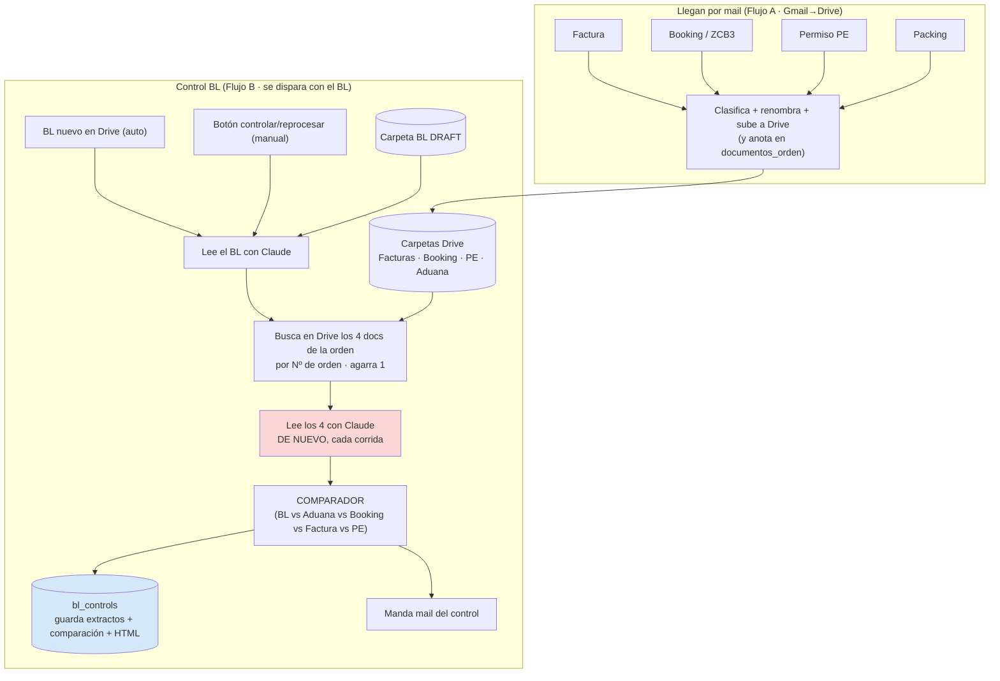
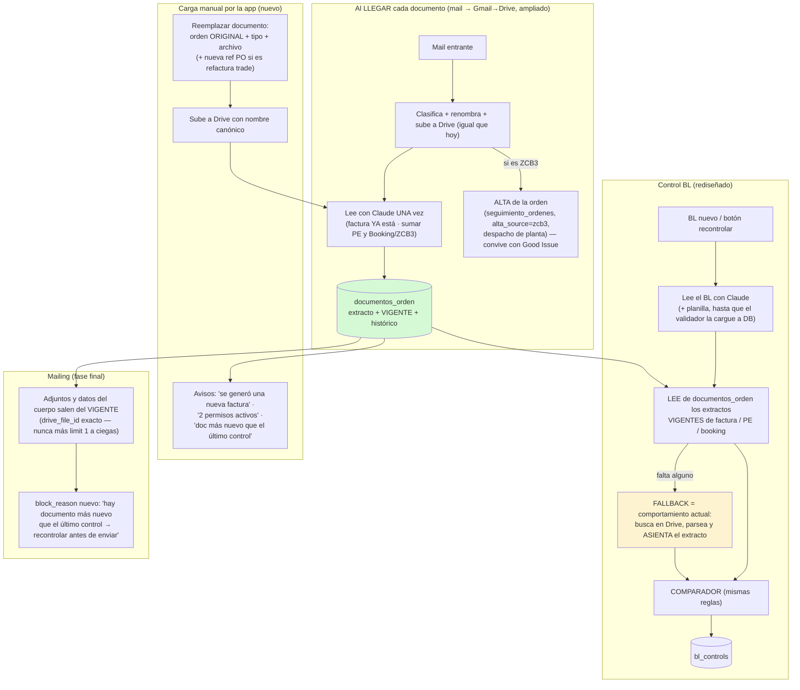

# Control BL — cómo se procesa HOY el control + OCR, y el problema de versionado de documentos

> Para revisión de John ANTES de diseñar el plan de rediseño (§4.1 del pedido).
> Todo verificado contra el workflow vivo `WVt6gvghL2nFVbt6` (pin `c14bec3a`) y la DB `xkppkzfxgtfsmfooozsm` el 2026-07-22.
> **Esto NO es el plan.** Es la base para que definas los escenarios de versionado que faltan.

---

## 1. Cómo funciona HOY (en criollo)

Hay **dos flujos n8n separados** que hoy NO se hablan por base de datos:

### Flujo A — "Gmail → Drive" (workflow `pBN4Wd1lcTSHNkFg`)
Cada documento que llega **por mail** (booking advice ZCB1/ZCB3, factura, permiso, packing, MIC/CRT) lo agarra un trigger IMAP, lo clasifica, lo **renombra** y lo **sube a una carpeta fija de Drive** según el tipo. También anota en la tabla `documentos_orden` que "para tal orden llegó tal tipo de documento" (es un índice de disponibilidad, **no guarda el contenido**). La **factura**, además, la lee con Claude al momento de llegar y vuelca los productos a `orden_productos`.

**Cómo nombra los archivos (clave para el versionado):**
| Documento | Nombre que le pone | Carpeta |
|---|---|---|
| Factura | `{Nº factura}_{orden}_FC` | FACTURAS EXPORTACION |
| Booking Advice | `{shipment}_{orden}_BA` (o `_{código}_BA`) | BA ZCB3 |
| Packing List | `{shipment}_{orden}_PL` | PACKING LIST |
| Permiso (PE) | (por el nombre del permiso) | Permisos de Exportación |
| CRT/MIC | `{shipment}_{orden}_CRT` etc. | MIC-CRT |

### Flujo B — "Control de Bill of Lading" (workflow `WVt6gvghL2nFVbt6`, 73 nodos)
Se dispara de dos formas: (1) automático, cuando **aparece un BL nuevo** en la carpeta `BL DRAFT` (poll cada minuto), o (2) manual, cuando alguien aprieta **"controlar / reprocesar"** en la herramienta.

Cuando corre, para **una orden**:
1. Baja el BL y lo lee con Claude (parser LOG-IN o MAERSK según la naviera).
2. **En ese mismo momento** sale a Drive a **buscar** los otros 4 documentos de la orden (planilla de aduana, booking, factura, PE), los baja y **los lee con Claude a todos, de nuevo, cada vez**.
3. Compara todo contra el BL, arma el resultado (OK / REVISAR campo por campo) y lo guarda en `bl_controls` (con el HTML del expediente, los extractos y la comparación).
4. Manda el mail del control y actualiza `mailing_orders`.

### Los números reales (últimos 7 días)
- ~16 controles/día (pico 46 el 20-07). Cada control exitoso: **5 lecturas con Claude** (~50s de IA) sobre 65-90s totales ≈ **~80 lecturas de IA por día**.
- **Todo se relee cada vez.** Los extractos quedan guardados en `bl_controls`, pero **el workflow nunca los vuelve a leer** — vuelve a bajar y releer los PDF aunque no hayan cambiado. Ese es el desperdicio que motiva el rediseño.
- **La factura se lee DOS veces**: una al llegar (Flujo A) y otra en cada control (Flujo B).

---

## 2. EL PUNTO CIEGO — cómo se "versiona" un documento HOY

Esto es lo que intuías que se te estaba pasando. **Hoy no hay ningún concepto de "documento vigente" en el sistema.** El versionado es 100% manual y frágil, y depende de dos mecanismos:

### 2.1 El BL sí desempata por versión (bien resuelto)
Cuando busca el BL, trae **todos** los que matcheen la orden en `BL DRAFT` y **elige el más reciente** (por fecha de modificación). Si subís un BL corregido, gana el nuevo. ✅

### 2.2 Los otros 4 documentos NO desempatan (frágil)
Para factura, PE, booking y aduana, el control busca en la carpeta **por número de orden y agarra el primero que aparece (`limit 1`, sin ordenar por fecha)**. Si en la carpeta hay **dos** archivos de la misma orden (el viejo y el nuevo), **agarra uno cualquiera** — no necesariamente el vigente.

**Por eso hoy la operativa "pisa" el archivo en el Drive** (mismo nombre PO+EPC): es la única forma de garantizar que quede UNO solo y que el control lea el correcto. Es un parche manual, no una regla del sistema.

**El problema con tu ejemplo de refactura:** cuando llega la factura nueva por mail (Flujo A), se sube con nombre `{Nº factura}_{orden}_FC`. Como **el número de factura cambió** al refacturar, el nombre es distinto → **NO pisa la vieja, crea una segunda**. Ahora hay dos facturas de la misma orden en la carpeta, y el control puede leer la vieja. Por eso hay una persona que entra al Drive y pisa a mano la factura con PO+EPC. Si esa persona no lo hace (o lo hace tarde), el control valida contra la factura equivocada **en silencio**.

### 2.3 Esto probablemente ya te está generando falsos positivos
En el listado de controles (`docs/_archivo/reportes/controles_bl_2026-07-22.csv`) hay un patrón llamativo: **~20 controles LOG-IN marcados REVISAR con motivo "BOOKING NO."** — el número de booking del BL no coincide con el del Booking Advice. En el caso que abrí (orden 4010736311): BL dice `LA0504763`, Booking Advice dice `LA0502566`. Eso es **exactamente** el síntoma de "hay dos booking advice para la orden y el control leyó el viejo" (o hubo un cambio de booking por roleo). **Todos esos REVISAR están sellados a mano** — o sea, el equipo ya los está tratando como falsos positivos y aprobándolos igual. **⚠️ Ver §2.4: John corrigió el mecanismo de este caso — no es (principalmente) versionado de archivos.**

### 2.4 Correcciones de dominio de John (22-07) — mandan sobre lo anterior

1. **BOOKING NO. — el mecanismo real del falso positivo.** No confundir el *número* de booking con versiones del *documento* Booking Advice. El BA son DOS documentos que llegan por mail: **ZCB1** (al ofrecimiento) y **ZCB3** (al despacho de planta, con posible actualización de cantidades — ej. granelero). El número que el control compara es el de referencia del **cuerpo del ZCB3**; difiere legítimamente del BL cuando el ZCB3 **no está actualizado**, o trae **placeholder** (aparece "LOGIN" porque todavía no hay número de referencia real). → El fix no es (solo) elegir mejor el archivo: es tratar ese campo como señal con staleness/placeholder conocidos. Va a la lista de **falsos positivos a depurar** junto con el de volumen (escala CD3 vs M³, comentado en el propio COMPARADOR).
2. **ORIGINALS TO BE RELEASED AT (MAERSK): ya corregido en sesión anterior.** El listado lo confirma: los 10 casos son todos ≤ 16-07 y los pins vigentes son del 17/18-07 — son controles viejos no re-corridos, no un bug vivo.
3. **Falso positivo histórico de factura:** el control reconocía el número **interno** de factura (empieza con 9) y lo tomaba como referencia para todas. La semántica real de refactura:
   - **STO (órdenes 4…):** mismo PO, nueva numeración de factura. Llega por mail → el flujo automático la renombra `{nuevaFactura}_{orden}_FC`. Detectable automáticamente.
   - **Terceros/trade (órdenes 1…):** la refacturación de SAP genera una **nueva referencia de orden** (misma estructura, inicial 1 — NO el interno 9) para la misma orden original. La persona que gestiona la refacturación la guarda **a mano** con el nuevo PO + `_FC`. → Necesita carga manual con orden original de referencia (alias de PO).
4. **ZCB3 = despacho de planta** en marítimas: trae el número de orden (el ID) y es el evento que inicia el proceso documental → es el disparador natural del alta.
5. **Packing:** fuera del control por ahora (solo edición a pedido de destino, diferido).
6. **Adjuntos del Mailing (verificado 22-07 contra el workflow):** los 6 adjuntos (BL draft, Factura, Packing, CO, PE, SEG) también se buscan en Drive por orden con `limit 1` **sin ordenar por fecha** → misma ruleta de versión que el control. El requisito de John — *"que nunca se adjunte a un correo un documento viejo equivocado"* — gobierna el diseño.

---

## 3. Lo que el rediseño tiene que resolver (y por eso te consulto ANTES)

El rediseño que pediste ("cada documento se lee al llegar y se guarda en DB; el control lee de DB en vez de re-leer") **obliga a definir el versionado explícitamente**, porque el parche de "pisar el archivo en Drive" deja de alcanzar: si guardamos en base de datos, la base tiene que saber **cuál es la versión vigente de cada documento por orden**.

Tus tres escenarios son justamente los casos límite del modelo de datos:

| Escenario | Qué pasa hoy | Qué hay que definir |
|---|---|---|
| **Permiso redocumentado** (2 PE para una orden, el 1º anulado) | El control agarra "uno" de los dos. Nadie marca cuál está anulado. | ¿Cómo sabe el sistema cuál PE es el vigente? ¿Se marca el viejo como anulado, o gana siempre el más reciente? ¿El nº de permiso nuevo es distinto? |
| **Packing reemplazado** | Se sube uno nuevo; puede quedar el viejo. | ¿El packing entra al control? (hoy no se compara). ¿Reemplaza por nombre o por versión? |
| **Factura refacturada** | Llega la nueva por mail con nombre distinto (nuevo Nº factura) → convive con la vieja. Alguien pisa a mano. | ¿La factura vigente es "la más reciente que llegó para la orden"? ¿O la que una persona marca como vigente? ¿Qué pasa con los productos de la factura vieja en `orden_productos`? |

**Tu idea de "subir el documento nuevo con la orden de referencia para que se actualice en el aplicativo" es la solución correcta** y encaja perfecto: en vez de depender de que alguien pise el archivo en Drive, la herramienta tendría un **"reemplazar documento de una orden"** (subís el archivo + elegís orden + tipo) que marca el nuevo como vigente y el viejo como reemplazado, en la base de datos. Es el mismo patrón que el validador de aduana (§4.3) y que la carga por lote — una familia de "subir con referencia de orden".

### Preguntas de negocio que necesito que definas (esto arma el modelo de datos)
1. **Regla de vigencia por defecto:** ¿"gana el último que llegó" (por fecha), o **siempre requiere que una persona confirme** cuál es el vigente? (afecta si el reemplazo es automático o revisado).
2. **Permiso:** cuando se redocumenta, ¿el nº de PE nuevo es siempre distinto del viejo? ¿Querés que el sistema **avise** "esta orden tiene 2 permisos, confirmá cuál" en vez de elegir solo?
3. **Factura refacturada:** ¿la factura vieja se **descarta** del todo, o hay que conservarla como histórico? (define si borramos o marcamos "reemplazada").
4. **Alcance del control:** hoy se comparan BL, Aduana, Booking, Factura, PE. ¿El **packing** debería entrar al control también, o sigue afuera?
5. **Disparo del reproceso:** cuando reemplazás un documento (ej. la factura correcta), ¿querés que el control del BL **se vuelva a correr automáticamente** para esa orden, o que quede un botón "recontrolar"?
6. **Alta por Booking/ZCB3:** confirmás que el Booking Advice o el ZCB3 puedan **dar de alta la orden** en el sistema (además del Good Issue actual), ¿con qué dato de la orden como identificador?

Con esas 6 respuestas puedo diseñar el modelo de datos de "documentos vigentes por orden" y el plan del rediseño con el diagrama de la arquitectura propuesta. Sin ellas, cualquier diseño se apoya en supuestos tuyos que preferís revisar vos.

---

## 4. Nota de riesgo para cuando se implemente (no ahora)
- El rediseño toca los dos triggers frágiles (Drive poll con `staticData`, y el Form Trigger cuya URL está cableada en Vercel) + el IMAP de Gmail→Drive. Iron Law con verificación por ejecución real.
- Escritura del workflow SOLO por el harness `put_*.py` (4 credenciales en 28 nodos).
- La persistencia hoy es "best-effort": 3 de 4 asientos a Supabase fallan **en silencio**. El rediseño debería cerrar eso (es parte de por qué faltan mailings — ver EXPLORE §8.2).

---

## 5. PROPUESTA DE DISEÑO (con las reglas que definió John el 22-07)

### 5.1 Concepto central: registro de **documentos vigentes por orden**

Extender la tabla **`documentos_orden`** (ya existe, ya la escribe Gmail→Drive con order_number + tipo +
file_name + drive_link) para que cada fila sea una **versión** de un documento, con:

| Columna nueva | Para qué |
|---|---|
| `extract` (jsonb) + `extracted_at` + `extract_model` | el resultado de la lectura IA, persistido UNA vez |
| `vigente` (bool) + `reemplazado_at` + `reemplazado_por` | la versión vigente por (orden, tipo); las viejas quedan como histórico auditable, nunca se borran |
| `doc_ref` | nº de factura / nº de PE / nº de booking — la referencia propia del documento |
| `po_alias` | la nueva referencia de PO que genera SAP al refacturar órdenes trade (1…) — linkea a la orden ORIGINAL |
| `origen` | `mail-auto` \| `app-upload` (quién lo cargó) |
| `drive_file_id` | puntero exacto al archivo (no más búsqueda a ciegas) |

Una fila nueva del mismo (orden, tipo) marca la anterior como reemplazada. **Regla de vigencia por
defecto: gana el último que llegó** (definición de John), con excepción del PE (abajo) y con override
manual siempre posible desde la app.

### 5.2 Flujos propuestos

### 5.3 Reglas por documento (las que definió John)

- **Factura STO (4…):** llega por mail → nueva versión vigente automática + aviso "se generó una nueva
  factura". Si la orden ya tenía control OK/sellado, alerta "documento posterior al control — recontrolar".
- **Factura trade (1…):** carga MANUAL por la app con la orden original + la nueva referencia de PO
  (alias). El extract puede traer otro número — la referencia que puso el humano manda.
- **PE:** el número siempre cambia. 2 PEs activos ⇒ **ALERTA**, y el vigente lo decide **la planilla de
  aduana** (el PE que ella referencia). Regla dura reforzada: PE de planilla = factura = BL = documento PE.
- **Booking/ZCB3:** el ZCB3 más reciente es el vigente (es el del despacho). El campo "booking no." del
  cuerpo se trata con conciencia de staleness/placeholder ("LOGIN") — depuración de falso positivo aparte.
- **Packing:** se registra la disponibilidad (ya pasa hoy) pero NO entra al control. Diferido.
- **Reproceso:** siempre MANUAL (botón recontrolar), con las alertas empujando a hacerlo.
- **orden_productos queda con UN escritor** (la ingesta al llegar la factura); el control deja de re-escribirla.

### 5.4 Fases (cada una con gate, Iron Law, prueba off-prod con branching + test_workflow)

| Fase | Qué entra | Riesgo principal |
|---|---|---|
| **QW quick-win** (antes que todo, barato) | Replicar el selector "más reciente" del BL en las 4 búsquedas del control y las 6 del mailing (returnAll + sort por modifiedTime) | Mata YA la ruleta "agarra uno cualquiera"; no toca semántica |
| **F1** | DDL de documentos_orden ampliada + Gmail→Drive suma parsers PE y Booking y asienta extractos/vigencia | Re-registro del trigger IMAP (verificar con ejecución real) |
| **F2** | Control BL lee extractos vigentes de DB con fallback a Drive-parse | El WF delicado: pin + drift-check + smoke real |
| **F3** | App: "Reemplazar documento" (con alias PO trade) + avisos (nueva factura / 2 PE / doc-post-control) + botón recontrolar | UX + gates de escritura |
| **F4** | Mailing: adjuntos + datos del cuerpo desde vigentes + block_reason nuevo. Alta por ZCB3 | Tocar resolver + claim |

### 5.5 Números honestos

Hoy ≈ **92 llamadas IA/día** (80 del control + ~12 factura al llegar). Con F1+F2 el control pasa de 5
llamadas a 2 (BL + planilla) → ≈ **65-70/día (-25%)**. Cuando el validador (§4.3) cargue la planilla a
DB, el control queda en 1 llamada → ≈ **50-55/día (-40%)**. El valor grande no es la plata: es que el
control tarda ~25s en vez de ~80s, los re-controles son casi gratis, y **control y mailing usan SIEMPRE
la versión vigente** — que es el requisito operativo real ("nunca adjuntar un documento viejo").

### 5.6 Por qué esta forma y no otra (recomendación única)

- **Extender `documentos_orden`** en vez de crear una tabla nueva: ya existe, ya tiene el writer
  (Gmail→Drive), ya modela versiones como filas (mismo orden+tipo, distinto file_name) — solo le falta
  contenido y vigencia. Una tabla, una regla.
- **Fallback al comportamiento actual** en el control: cero dependencia dura de la DB — si el extracto
  no está, el control funciona exactamente como hoy y de paso asienta el extracto. La migración no tiene
  big-bang ni ventana de rotura.
- **La vigencia vive en DB, no en Drive:** el parche de "pisar el archivo" deja de ser necesario, pero
  sigue funcionando durante la transición (el QW hace que "el más reciente" gane también en Drive).

